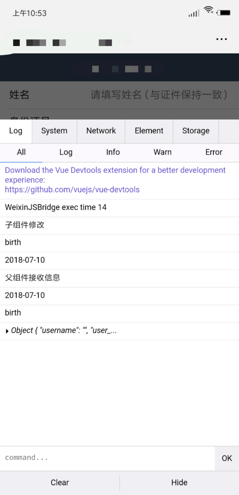

## H5移动端调试神器 - vconsole.js

> vconsole.js git地址：[https://github.com/Tencent/vConsole](https://github.com/Tencent/vConsole)

### 引入方式

vconsoleUtil.js

```javascript
import VConsole from 'vconsole'
var vConsole = new VConsole();
export default vConsole
```

### 调用方式

以vue项目为例

```javascript
// 在main.js中引入
import './utils/vconsoleUtil.js'
```

### 效果



BY-Luca_LJX([git地址](https://github.com/LucaLJX/jianshu_demo/blob/master/WEB%E7%B1%BB%E5%BA%93%E6%8F%92%E4%BB%B6%E4%BD%BF%E7%94%A8%E6%A1%88%E4%BE%8B/H5%E7%A7%BB%E5%8A%A8%E7%AB%AF%E8%B0%83%E8%AF%95%E7%A5%9E%E5%99%A8%20-%20vconsole.js/images/vconsole-demo.png))