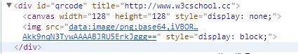

## qrcode.js使用js生成二维码（并下载）的实践

### 知识点

 - base64数据形式

 > Base64是一种用64个字符来表示任意二进制数据的方法。 -- [ 廖雪峰官方网站 ](https://www.liaoxuefeng.com/wiki/001374738125095c955c1e6d8bb493182103fac9270762a000/001399413803339f4bbda5c01fc479cbea98b1387390748000)

 > Base64编码有哪些情景需求？ -- [ 知乎 ](https://www.zhihu.com/question/36306744/answer/71626823)


### 案例场景

 - 后台生成邀请链接，前端拿到链接之后处理成二维码图片并下载到本地，用于转发。

### qrcode.js及jquery-qrcode.js实现生成二维码

 - qrcode.js github地址： [ qrcode ](https://github.com/davidshimjs/qrcodejs)
 - jquery-qrcode.js github地址： [ jquery-qrcode](https://github.com/jeromeetienne/jquery-qrcode)

#### 1.html 代码

```html
  <div id="qrcode"></div>
  <!-- 用于生成二维码的容器 -->
```

#### 2.js 代码
```javascript
  // qrcode.js
  var qrcode = new QRCode(document.getElementById("qrcode"), {
    text: "i am the first qrcode",
    width: 128, //生成的二维码的宽度
    height: 128, //生成的二维码的高度
    colorDark : "#000000", // 生成的二维码的深色部分
    colorLight : "#ffffff", //生成二维码的浅色部分
    correctLevel : QRCode.CorrectLevel.H
  });
  //jquery-qrcode.js
  var qrcode = $('#qrcode').qrcode({
    width: 128,
    height: 128,
    text: "size doesn't matter"
  });
```

#### 3.qrcode.js 与jquery-qrcode.js区别

 - qrcode.js可以指定生成的二维码深色、浅色区域块的颜色，jquery-qrcode.js只能默认黑白两色
 - qrcode.js支持clear()和makeCode()方法，用于便捷清空二维码、更换二维码，jquery-qrcode.js不支持

#### 4.qrcode.js生成二维码原理



 - qrcode.js在用于生成二维码的容器#qrcode内生成一个canvas标签和一个img标签，并且以base64的编码格式描述图片信息。

### 点击按钮，生成的二维码图片保存到本地

