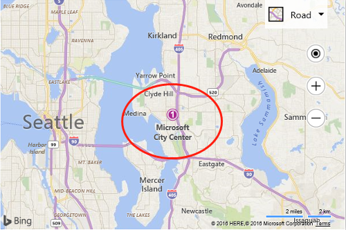
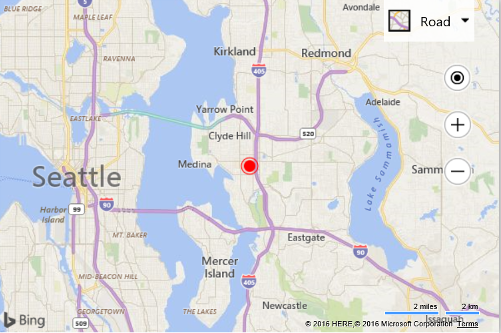
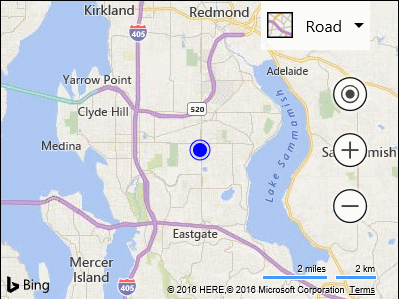

# bing Map 在vue项目中的使用

## bing Map 使用教程（基础）

> 参考文档： [bing Map 官方教程](https://msdn.microsoft.com/en-us/library/mt712557.aspx)

### bing Map 初始化

 - 引入bing map资源

```html
<script type='text/javascript' src='http://www.bing.com/api/maps/mapcontrol?callback=GetMap&key=[YOUR_BING_MAPS_KEY]' async defer></script>
```

 - 初始化地图

```html
<div id="myMap"></div>

<script type='text/javascript'>
  function GetMap()
  {
    var map = new Microsoft.Maps.Map('#myMap');
    //Add your post map load code here.
  }
</script>
``` 

 - 设置地图控制参数
    - 常用控制参数
      - branch
        - 加载地图sdk的哪个分支：release（默认）、experimental
      - callback
        - 地图控制脚本加载完成后的回调（默认：GetMap）
      - key
        - 用户使用的userKey（[详情](https://msdn.microsoft.com/en-us/library/mt712553.aspx)）
      - setLang
        - 指定用于地图标签和导航控件的语言
        - 常用：中国大陆（zh-CN）、中国香港（zh-HK）、简体中文（zh-Hans）、中国台湾（zh-TW）、英文-英国（en-GB）、英文-美国（en-US）
      - setMkt（[详情](https://msdn.microsoft.com/en-us/library/mt712553.aspx)）
      - UR（[详情](https://msdn.microsoft.com/en-us/library/mt712553.aspx)）

 - 给bing map添加地图事件（[参考](https://msdn.microsoft.com/en-us/library/mt736399.aspx)）

```javascript
  //  核心代码-demo
  Microsoft.Maps.Events.addHandler(你的地图名称, 触发地图事件名称, function() { 触发的事件 });

  // 常用实例
  //Add view change events to the map.
  // 视图更改事件
  Microsoft.Maps.Events.addHandler(map, 'viewchangestart', function () { highlight('mapViewChangeStart'); });
  Microsoft.Maps.Events.addHandler(map, 'viewchange', function () { highlight('mapViewChange'); });
  Microsoft.Maps.Events.addHandler(map, 'viewchangeend', function () { highlight('mapViewChangEnd'); });

  //Add mouse events to the map.
  // 鼠标事件
  Microsoft.Maps.Events.addHandler(map, 'click', function () { highlight('mapClick'); });
  Microsoft.Maps.Events.addHandler(map, 'dblclick', function () { highlight('mapDblClick'); });
  Microsoft.Maps.Events.addHandler(map, 'rightclick', function () { highlight('mapRightClick'); });
  Microsoft.Maps.Events.addHandler(map, 'mousedown', function () { highlight('mapMousedown'); });
  Microsoft.Maps.Events.addHandler(map, 'mouseout', function () { highlight('mapMouseout'); });
  Microsoft.Maps.Events.addHandler(map, 'mouseover', function () { highlight('mapMouseover'); });
  Microsoft.Maps.Events.addHandler(map, 'mouseup', function () { highlight('mapMouseup'); });
  Microsoft.Maps.Events.addHandler(map, 'mousewheel', function () { highlight('mapMousewheel'); });

  //Add addition map event handlers
  Microsoft.Maps.Events.addHandler(map, 'maptypechanged', function () { highlight('maptypechanged'); });
```

### bing Map 添加图钉（[详情](https://msdn.microsoft.com/en-us/library/mt712640.aspx)）

#### 基本图钉示例

```javascript
function GetMap() {
  var map = new Microsoft.Maps.Map('#myMap', {
    credentials: 'Your Bing Maps Key',
    center: new Microsoft.Maps.Location(47.6149, -122.1941)
  });

  var center = map.getCenter();

  //Create custom Pushpin
  //  创建一个图钉
  var pin = new Microsoft.Maps.Pushpin(center, {
    // demo_1
    title: 'Microsoft', // 图钉的标题
    subTitle: 'City Center', // 图钉主体文字
    text: '1' // 图钉内的文字
    // demo_2
    color: 'red', // 纯色图钉
  });

  //Add the pushpin to the map
  map.entities.push(pin);
}
```

> demo_1



> demo_2



#### 添加自定义图片图钉（[详情](https://msdn.microsoft.com/en-us/library/mt712698.aspx)）

```javascript
function GetMap() {
  var map = new Microsoft.Maps.Map('#myMap',
  {
    credentials: 'You Bing Maps Key'
  });

  var center = map.getCenter();

  //Create custom Pushpin
  var pin = new Microsoft.Maps.Pushpin(center, {
    icon: 'images/poi_custom.png', // 自定义图片路径
    anchor: new Microsoft.Maps.Point(12, 39)
  });

  //Add the pushpin to the map
  map.entities.push(pin);
}
```

> 自定义图标的图钉


#### bing Map 给图钉添加事件

 - 核心代码

```javascript
//Create a pushpin.
  var pushpin = new Microsoft.Maps.Pushpin(map.getCenter());
  map.entities.push(pushpin);

  //Add mouse events to the pushpin.
  // 将自定义方法及鼠标事件添加到图钉上面
  Microsoft.Maps.Events.addHandler(pushpin, 'click', function () { highlight('pushpinClick'); });
  Microsoft.Maps.Events.addHandler(pushpin, 'mousedown', function () { highlight('pushpinMousedown'); });
  Microsoft.Maps.Events.addHandler(pushpin, 'mouseout', function () { highlight('pushpinMouseout'); });
  Microsoft.Maps.Events.addHandler(pushpin, 'mouseover', function () { highlight('pushpinMouseover'); });
  Microsoft.Maps.Events.addHandler(pushpin, 'mouseup', function () { highlight('pushpinMouseup'); });
```

#### bing Map 给图钉添加hover样式

> 其核心还是给bing Map的图钉添加事件，通过事件修改图钉的样式

```javascript
// demo
var defaultColor = 'blue';
var hoverColor = 'red';
var mouseDownColor = 'purple';

var pin = new Microsoft.Maps.Pushpin(map.getCenter(), {
    color: defaultColor
});

map.entities.push(pin);

Microsoft.Maps.Events.addHandler(pin, 'mouseover', function (e) {
    e.target.setOptions({ color: hoverColor });
});

Microsoft.Maps.Events.addHandler(pin, 'mousedown', function (e) {
    e.target.setOptions({ color: mouseDownColor });
});

Microsoft.Maps.Events.addHandler(pin, 'mouseout', function (e) {
    e.target.setOptions({ color: defaultColor });
});
```

> 给图钉添加hover样式



#### bing Map 固定锚点

> 开发人员在使用自定义图钉时遇到的最常见问题之一是，当他们缩放地图时，看起来好像他们的图钉正在漂移到或离开它所要锚定的位置。这是由于图钉选项中的锚点值不正确。锚点指定图像的哪个像素坐标相对于图像的左上角应与图钉位置坐标重叠。

> [常见配置参考](https://msdn.microsoft.com/en-us/library/mt712695.aspx)


## bing Map 在vue中使用

### vue引入bing Map可能会遇到的问题

> 由于vue一般引用第三方插件是用import的方式进行的，所以的在html中使用script标签引入bing Map SDK会出现两种问题

> 1.在控制台会报错：Mirosorft is not defined

> 2.vue-cli会报错：Mirosorft is not defined

**这里的原因是由于异步加载，所以在调用"Mirosorft"的时候可能SDK并没有引用成功**

### 解决“Mirosorft is not defined”的错误

> [文档参考](https://segmentfault.com/a/1190000012815739)

解决“Mirosorft is not defined”的错误，只要在项目中保证调用地图之前，能够正确引入相关工具类就行了。

```javascript
// bing map init devTools
export default {
  init: function (){
    console.log("初始化bing地图脚本...");
    // bing map key
    const bingUesrKey = '你的bingMap Key';
    const BingMap_URL = 'http://www.bing.com/api/maps/mapcontrol?callback=GetMap&key=' + bingUesrKey;
    return new Promise((resolve, reject) => {
      if(typeof Microsoft !== "undefined") {
        resolve(Microsoft);
        return true;
      }

      // 插入script脚本
      let scriptNode = document.createElement("script");
      scriptNode.setAttribute("type", "text/javascript");
      scriptNode.setAttribute("src", BingMap_URL);
      document.body.appendChild(scriptNode);

      // 等待页面加载完毕回调
      let timeout = 0;
      let interval = setInterval(() => {
        // 超时10秒加载失败
        if(timeout >= 20) {
          reject();
          clearInterval(interval);
          console.error("bing地图脚本初始化失败...");
        }
        // 加载成功
        if(typeof Microsoft !== "undefined") {
          resolve(Microsoft);
          clearInterval(interval);
          console.log("bing地图脚本初始化成功...");
        }
        timeout += 1;
      }, 500);
    });
  }
}  

// bing map vue
import bingMap from './**/bing-map';
bingMap.init()
  .then((Microsoft) => {
      console.log(Microsoft)
      console.log("加载成功...")
      // 开始地图操作
  })
```

### 集成bing Map组件到vue中

#### 需要达到的功能

 - 在vue项目中成功加载bing Map （完成）
 - 当点击bing Map的时候，返回点击点的经纬度 （完成）
    - 子组件触发事件返回参数到父组件
 - 当已有经纬度的时候，加载bingMap自动显示其经纬度所在的位置并设置图钉 （待完成）

#### 子组件触发事件返回参数到父组件

 - 实现原理
    - [vue-$meit](https://cn.vuejs.org/v2/api/#vm-emit)

 - 核心代码

```html
// 子组件
<template>
<div @click="iclick"></div>
</template>
methods:{
  iclick(){
    let data = {
      a:'data'
    };
    this.$emit('ievent', data1, 'data2Str');
  }
}
// 父组件
<i-template @ievent = "ievent"></i-template>
methods:{
  ievent(...data){
    console.log('allData:',data); // data为包含传过来所有数据的数组，第一个元素是对象，第二个元素是字符串
  }
}
```

#### 封装bing Map通用组件
```html
// 核心代码
<template>
  <div class="map-container">
    <div id="localMap"></div>
  </div>
</template>

<script>

import initBingMap from './initMap.js'

export default {
  data () {
    return {
      lngNum: null, // 经度
      latNum: null, // 纬度
    }
  },
  created: function () { 
    let _this = this;
    initBingMap.init()
    .then((Microsoft) => {
      console.log(Microsoft)
      console.log("加载成功...")
      _this.initMap();
    })
  },
  methods: {
    initMap () {
      let _this = this;
      let map = new Microsoft.Maps.Map('#localMap', {
        credentials: 'AgzeobkGvmpdZTFuGa7_6gkaHH7CXHKsFiTQlBvi55x-QLZLh1rSjhd1Da9bfPhD'
      });
      Microsoft.Maps.Events.addHandler(map, 'click', _this.getClickLocation);
    },
    getClickLocation (e) {
      //若点击到地图的标记上，而非地图上
      let [_this, loc] = [this, null];
      if (e.targetType == 'pushpin') {
        loc = e.target.getLocation();
      }
      //若点击到地图上
      else {
        var point = new Microsoft.Maps.Point(e.pageX, e.pageY);
        loc = e.target.tryPixelToLocation(point, Microsoft.Maps.PixelReference.page);
      }
      console.log(loc.latitude+", "+loc.longitude);
      console.log(loc);
      _this.lngNum = loc.longitude;
      _this.latNum = loc.latitude;
      let data = {
        lngNum: _this.lngNum,
        latNum: _this.latNum
      }
      this.$emit('getLocationNums',data);
    },
  }
}
</script>

<style scoped>
  .map-container {
    width: 100%;
    height: 400px;
    border: 1px solid #000;
  }
</style>
```

#### 在组件中调用bing Map通用组件
```javascript
// 引入bingMap
import bingMapsLayer from 'bingMap.vue'

// component中定义
components: {
  bingMapsLayer
},

// template中使用
<bing-maps-layer @getLocationNums="getLocationNums"></bing-maps-layer>

// 定义触发点击标记返回经纬度的事件函数
getLocationNums (...data) {
  let _this = this;
  console.log('click');
  console.log(data);
  // 这里的data中即子组件bingMap返回的点击获取的经纬度值
},
```

## 未完待续

### 后续

 - 在bingMap组件中使用自定义图钉
 - 在bingMap组件中定义可拖动图钉标记经纬度
 - 集成bingMap自定义搜索
 - 集成bingMap图钉详情展示

