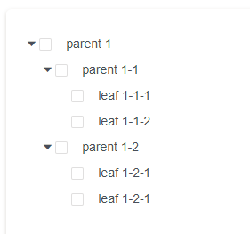

## JSON数据处理-链型数据与树型数据互转



 > 日常工作中，前端在搭建大型后端管理平台的时候，经常会需要渲染树型结构的层级展示，在这个过程中，有时候会碰到前端返回非树型结构的数据，那么我们就需要对齐进行树型结构的数据转换。

 ### 链型数据转树型数据

 如下json示意，我们需要将以下类型的链型数据转换为树形数据

 ```javascript

//  原始数据 - 链型
 const lineList = [
        {
          name: 'A-1-14',
          id: 14,
          parentId: 1
        },
        {
          name: 'A-4',
          id: 4,
          parentId: null
        },
        {
          name: 'A-99-46',
          id: 9946,
          parentId: 99
        },
        {
          name: 'A-99-23',
          id: 9923,
          parentId: 99
        },
        {
          name: 'A-8',
          id: 8,
          parentId: null
        },
        {
          name: 'A-1-17',
          id: 17,
          parentId: 1
        },
        {
          name: 'A-8-23',
          id: 823,
          parentId: 8
        },
        {
          name: 'A-1',
          id: 1,
          parentId: null
        },
        {
          name: 'A-4-16',
          id: 416,
          parentId: 4
        },
        {
          name: 'A-1-15',
          id: 15,
          parentId: 1
        },
        {
          name: 'A-4-25',
          id: 425,
          parentId: 4
        },
        {
          name: 'A-1-12',
          id: 12,
          parentId: 1
        },
        {
          name: 'A-99-15',
          id: 9915,
          parentId: 99
        },
        {
          name: 'A-4-23',
          id: 423,
          parentId: 4
        },
        {
          name: 'A-1-16',
          id: 16,
          parentId: 1
        },
        {
          name: 'A-8-46',
          id: 846,
          parentId: 8
        },
        {
          name: 'A-8-15',
          id: 815,
          parentId: 8
        },
        {
          name: 'A-99',
          id: 99,
          parentId: null
        },
        {
          name: 'A-416-1',
          id: 41699,
          parentId: 416
        },
        {
          name: 'A-416-2',
          id: 4169,
          parentId: 416
        }
      ];

  // 目标数据 - 树型
  const treeList = [
    {
      id: 1,
      name: 'A-1',
      children: [
        {
          id: 11,
          name: 'A-1-11',
          parentId: 1
        },
        {
          id: 12,
          name: 'A-1-12',
          parentId: 1
        }
      ]
    }
  ];
 ```

 #### 方法一：利用对象的引用进行处理

 ```javascript
 
 // demo_1
 function fmtLineToTree (list, idStr, parentIdStr, childrenStr) {
  let [newArr, newObj, _idStr, _parentIdStr, _childrenStr] = [[], {}, idStr, parentIdStr, childrenStr];
  // newArr - 构建的新的空数组，即目标数组
  // newObj - 构建的新的对象，用于辅助处理（对象的引用）
  // _id - 主键的字段名 - key
  // _parentIdStr - 父层主键的字段名 - key
  // _childrenStr - 新数组中子节点的合集字段名 - key

  // step - 1
  // 将原来的数组遍历构建为以主键为key的对象合集
  for (let i = 0; i < list.length; i++) {
    newObj[list[i][_idStr]] = list[i]
  }

  // step - 3
  // 将原数组中每个对象的parentId作为新对象的key值，在新对象中进行查找
  // 如果找到，则说明数组的当前对象为此对象的子集
  // 如果找不到，则说明数组的当前对象为根节点
  for (let j = 0; j < list.length; j++) {
    let node = list[j];
    let findNode = newObj[findNode[_parentIdStr]];
    // 如果能找到 findNode - 说明此node是findNode的子集
    if (findNode) {
      // 判断是否已经存在children字段
      if (!findNode[_childrenStr]) {
        findNode[_childrenStr] = [];
        findNode[_childrenStr].push(node);
      } else {
        // 如果不存在 - 则为根节点
        newArr.push(node);
      }
    }
  }

  // 返回新数据
  return newArr;
}

 ```