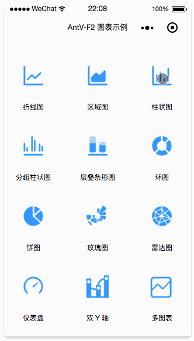
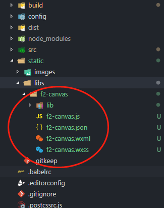

# 小程序开发-mpvue中使用图表库



## 图表库

在开发中使用图表库，推荐百度的 **Echarts**，和阿里出品的 **AntV**家族，其中移动端为 **AntV-F2**

 - Echarts：[Echarts](http://echarts.baidu.com/)
 - AntV-F2：[AntV-F2](https://antv.alipay.com/zh-cn/f2/3.x/index.html)

 这里antV-F2有现成的原生小程序使用教程（wx-f2：[wx-f2](https://github.com/antvis/wx-f2)），就不做赘述，只讲解如何在mpvue框架中使用。

 ## mpvue框架中使用 Echarts

 > 参考文档： [mpvue-echarts](https://github.com/F-loat/mpvue-echarts)

  - 安装 **mpvue-echarts** 及 **echarts** 插件

  ```shell
  ## mpvue-echarts
  npm i mpvue-echarts --save
  ## echarts
  npm i echarts --save
  ```

  - vue文件中以组件的形式使用

  ```html
  <template>
    <div class="echarts-wrap">
      <mpvue-echarts :echarts="echarts" :onInit="onInit" canvasId="demo-canvas" />
    </div>
  </template>

  <script>
  import echarts from 'echarts'
  import mpvueEcharts from 'mpvue-echarts'

  let chart = null;

  function initChart(canvas, width, height) {
    chart = echarts.init(canvas, null, {
      width: width,
      height: height
    });
    canvas.setChart(chart);

    var option = {}; // ECharts 配置项

    chart.setOption(option);

    return chart; // 返回 chart 后可以自动绑定触摸操作
  }

  export default {
    components: {
      mpvueEcharts
    },
    data () {
      return {
        echarts,
        onInit: initChart
      }
    }
  }
  </script>

  <style scoped>
  .echarts-wrap {
    width: 100%;
    height: 300px;
  }
  </style>
  ```

  ## mpvue框架中使用antV-F2

  antV-F2官方给出了小程序原生的使用方式，并无vue相关的依赖插件，所以我们把小程序原生插件放在 ** “static” ** 文件夹中进行使用

  **注意：这里不能放在"src"目录下，防止被webpack工具打包**

  **wx-f2中看 ff-canvas 源码可以看出. vue文件data内部的opts.onInit 是一个 function 不能被传递到组件上, 通过主动调用 ff-canvas组件 的 init 方法, 并且将initChart传入就即正常使用了**

   - 将wx-f2对应的导入项目static文件夹中

   

   - 项目src目录下pages.js以小程序的方式引入wx-f2组件配置

   ```javascript
   module.exports = [
    {
      path: 'pages/testF2/index', // 页面路径，同时是 vue 文件相对于 src 的路径
      config: {
        // 引入使用wx-f2组件
        usingComponents: {
          'ff-canvas': '/static/libs/f2-canvas/f2-canvas'
        }
      }
    },
    {
      path: 'packageA/logs',
      subPackage: true,
      config: { // 页面配置，即 page.json 的内容
        navigationBarTitleText: '查看启动日志'
      }
    }
  ]
   ```

  - vue文件中使用

  ** 注意：mpvue中使用必须以懒加载的形式使用，即主动触发渲染，否则会失败 **

  ```html
  <!-- demo -->
  <template>
    <div style="height: 100vh">
      <!-- opts 前面加冒号 -->
      <ff-canvas id="column" canvas-id="column" :opts="opts" />
    </div>
  </template>

  <script>
    // 这里注意路径，要引入 static 文件夹中的f2.js文件
    import F2 from "../../../static/f2-canvas/lib/f2";

    let chart = null;

    function initChart(canvas, width, height) {
      // 使用 F2 绘制图表
      const data = [{
          year: "1951 年",
          sales: 38
        },
        {
          year: "1952 年",
          sales: 52
        },
        {
          year: "1956 年",
          sales: 61
        },
        {
          year: "1957 年",
          sales: 145
        },
        {
          year: "1958 年",
          sales: 48
        },
        {
          year: "1959 年",
          sales: 38
        },
        {
          year: "1960 年",
          sales: 38
        },
        {
          year: "1962 年",
          sales: 38
        }
      ];
      chart = new F2.Chart({
        el: canvas, 
        width,
        height
      });

      chart.source(data, {
        sales: {
          tickCount: 5
        }
      });
      chart.tooltip({
        showItemMarker: false,
        onShow(ev) {
          const {
            items
          } = ev;
          items[0].name = null;
          items[0].name = items[0].title;
          items[0].value = "¥ " + items[0].value;
        }
      });
      chart.interval().position("year*sales");
      chart.render();
      return chart;
    }

    export default {
      data() {
        return {
          motto: "Hello World",
          opts: {
            // 使用延时初始化 -- 重要
            lazyLoad: true
          }
        };
      },

      components: {},

      methods: {

      },

      onLoad() {
        // 在 onLoad 内部通过id找到该组件, 然后调用该组件的初始化方法
        this.$mp.page.selectComponent('#column').init(initChart)
      }
    };
  </script>

  <style scoped>
  </style>
  ```

  **注意：**

  1. 建议 ‘ this.$mp.page.selectComponent('#column').init(initChart) ’ 这行代码写在vue生命周期mounted里面，而不是小程序onLoad里面，因为vue页面加载在小程序后面 

  2. wx-f2中的tooltip失效，并未使用成功，后续待解决（touch事件绑定成功，但对应的图表效果没有）
  