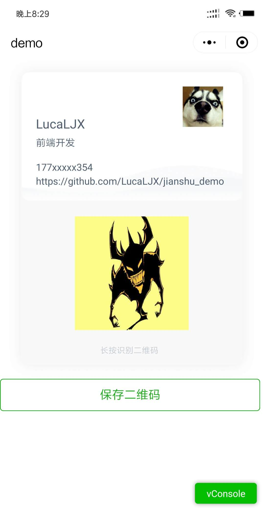

# 小程序开发-利用canvas实现保存二维码海报到本机



## 场景及需求

 > 在小程序开发过程中，经常需要实现保存某个页面为带小程序码的二维码海报图片到本地，然后用于分享或者发朋友圈等操作。

## 主要技术点及小程序相关api

### 技术注意事项

 - 小程序的canvas与H5 canvas使用api大部分一致，但由于小程序中没有DOM节点的概念，所以不能使用很多现成的工具库
 - 小程序canvas默认宽度300px、高度225px
 - 小程序canvas相关的api中单位为px，并非rpx，所以在业务实现过程中需要处理适配
 - 小程序canvas对跨域图片不支持，需要先将图片缓存到本地

### 技术点

- wx.getImageInfo()
- wx.getSystemInfo()
- wx.canvasToTempFilePath()
- wx.saveImageToPhotosAlbum()
- canvas渲染相关api

### 整体流程

1.先获取所有图片资源，线上图片需要缓存到本地，使用图片的本地路径做渲染

2.获取设备信息，根据设备宽度计算出宽度因子x

3.绘制canvas

4.将canvas转化为图片，将图片保存到本机

## 实现

### 宽度因子x及元素宽度的尺寸计算

> rpx（responsive pixel）: 可以根据屏幕宽度进行自适应。规定屏幕宽为750rpx。如在 iPhone6 上，屏幕宽度为375px，共有750个物理像素，则750rpx = 375px = 750物理像素，1rpx = 0.5px = 1物理像素。

> 参考文档： [小程序-WXSS-尺寸单位](https://developers.weixin.qq.com/miniprogram/dev/framework/view/wxss.html)

由文档可以看出不同的设备，宽度是不同数值的px，但是均为750rpx，由此可以利用750rpx计算出宽度因子x:

> 设备宽度 / 750

以设计稿宽度750rpx为例，则在不同设备下，设计稿宽度y在不同设备下的px宽度均为：

> Y = y * x 

> Y = y * (设备宽度 / 750)

由此，在实现中，canvas标签宽高需要设置为变量,且使用微信提供的  **wx.getSystemInfo（）** 接口获取设备宽度信息后，进行计算

```html
<canvas canvas-id="qrcode-canvas" :style="{width: canvas.width + 'px', height: canvas.height + 'px'}"></canvas>
```

```javascript
// wx.js
// 获取设备基本信息
export function wxGetSystemInfo () {
  return new Promise(async function (resolve, reject) {
    wx.getSystemInfo({
      success: function (res) {
        resolve(res);
      },
      fail: function (err) {
        reject(err);
      }
    })
  });
}
// demo.vue
// 获取手机基本信息
async getPhoneSystemInfo () {
  let _this = this;
  let systemInfoRes = await wxGetSystemInfo();
  _this.canvas.width = systemInfoRes.screenWidth;
  // 设计稿宽高为 750 * 912
  _this.canvas.height = 912 / 750 * _this.canvas.width;
  _this.storageQrcode();
},
```

### 获取远程图片缓存到本地使用

 - api
    - wx.getImageInfo()
    - 参考文档： [wx.getImageInfo()](https://developers.weixin.qq.com/miniprogram/dev/api/media-picture.html#wxgetimageinfoobject)

  注意：**如果是本地图片,即'static'文件夹中的图片，如'/static/logo.png'经过wx.getImageInfo返回的path会省去开头的'/'，即'static/logo.png'，这会导致拿不到资源，所以本地图片不需要调用wx.getImageInfo()进行本地缓存**

  ```javascript
  // wx.js
  // 获取图片基本信息
  export function wxGetImgInfo (imgUrl) {
    return new Promise(async function (resolve, reject) {
      wx.getImageInfo({
        src: imgUrl,
        success: function (res) {
          resolve(res);
        },
        fail: function (err) {
          reject(err);
        }
      })
    });
  }
  // demo.vue
  // 缓存远程图片
  async storageQrcode () {
    let _this = this;
    // 背景图url转path
    // let bgRes = await wxGetImgInfo(_this.bgImg);
    // _this.imgPath.bgImg = bgRes.path;
    // Logo url转path
    // let logoRes = await wxGetImgInfo(_this.logo);
    // _this.imgPath.logo = logoRes.path;
    
    // 头像 url转path
    // let headerImgRes = await wxGetImgInfo(_this.cardDetail.header);
    // _this.imgPath.headerImg = headerImgRes.path;
    // 二维码 url转path
    let qrCodeRes = await wxGetImgInfo(_this.qrCode);
    _this.imgPath.qrCode = qrCodeRes.path;
    console.log(_this.imgPath);
    // _this.initCanvas(_this.canvas.width);
  },
  ```

  ### 绘制canvas

  canvas绘制主要用到了图片绘制、文字绘制，图片绘制及文字绘制的时候，需要引入上文说到的宽度因子x进行计算

  #### 图片绘制

   - canvasContext.drawImage
      - 参考文档： [canvasContext.drawImage](https://developers.weixin.qq.com/miniprogram/dev/api/canvas/draw-image.html)

  这里的图片绘制之前先计算宽度因子

  ```javascript
    let _this = this;
    // variableVal即为上文拿到的设备宽度
    const variableNum = variableVal / 750; // 根据设备宽度算出一个rpx为多少px
    const ctx = wx.createCanvasContext('qrcode-canvas');
    // 清除画布上矩形的内容
    ctx.clearRect(0, 0, 0, 0);
    // 绘制上部card背景图
    const bgImgDesc = {
      url: _this.imgPath.bgImg,
      left: 0,
      top: 0,
      width: 750 * variableNum,
      height: 912 * variableNum
    };
    ctx.drawImage(bgImgDesc.url, bgImgDesc.left, bgImgDesc.top, bgImgDesc.width, bgImgDesc.height);
    ctx.draw();
  ```

  #### 文字的绘制

   - canvasContext.setFillStyle - 设置颜色
   - canvasContext.setFontSize - 设置大小
   - canvasContext.fillText - 填充文本

  ```javascript
  const nameDesc = {
    text: _this.cardDetail.name,
    fontSize: 36 * variableNum,
    color: '#4F5E6F',
    left: 102 * variableNum,
    top: 200 * variableNum
  };
  ctx.setFillStyle(nameDesc.color);
  ctx.setFontSize(nameDesc.fontSize);
  ctx.fillText(nameDesc.text, nameDesc.left, nameDesc.top);
  ctx.draw();
  ```

  ### canvas转图片并保存到本地

  - wx.canvasToTempFilePath - canvas转图片
      - 参考文档： [wx.canvasToTempFilePath](https://developers.weixin.qq.com/miniprogram/dev/api/canvas/temp-file.html)
  - wx.saveImageToPhotosAlbum - 保存图片到本地
      - 参考文档： [wx.saveImageToPhotosAlbum](https://developers.weixin.qq.com/miniprogram/dev/api/media-picture.html#wxgetimageinfoobject)

  #### 注意点

  **tip： wx.canvasToTempFilePath() 在 draw 回调里调用该方法才能保证图片导出成功。**

  由于导出图片需要在canvas绘制图片的draw()方法回调中使用才能,所以我们在绘制canvas的时候直接转canvas为图片，然后将路径存下来，点击下载的时候，再直接拿图片路径进行下载操作。

  ```javascript
  // wx.js
  // canvas画布转图片
  export function wxCanvasToTempFilePath (canvasObj) {
    return new Promise(async function (resolve, reject) {
      wx.canvasToTempFilePath({
        x: canvasObj.x,
        y: canvasObj.y,
        width: canvasObj.width,
        height: canvasObj.height,
        destWidth: canvasObj.destWidth,
        destHeight: canvasObj.destHeight,
        canvasId: canvasObj.canvasId,
        fileType: canvasObj.fileType ? canvasObj.fileType : 'png',
        success: function (res) {
          resolve(res);
        },
        fail: function (err) {
          reject(err);
        }
      })
    });
  }
  // demo.vue
  // 绘制canvas
  initCanvas () {
    let _this = this;
    // 绘制canvas
    ......
    ctx.draw(false, function () {
      _this.saveImg();
    });
  },
  // 将canvas转为图片
  async saveImg () {
    let _this = this;
    const canvasObj = {
      x: 0,
      y: 0,
      width: _this.canvas.width,
      height: _this.canvas.height,
      destWidth: _this.canvas.width * 4,
      destHeight: _this.canvas.height * 4,
      canvasId: 'qrcode-canvas',
      fileType: 'png'
    };
    let imgRes = await wxCanvasToTempFilePath(canvasObj);
    _this.qrCodeImgPath = imgRes.tempFilePath;
  },
  ```

  ### 下载图片到本地

  ```html
  <canvas canvas-id="qrcode-canvas" :style="{width: canvas.width + 'px', height: canvas.height + 'px'}"></canvas>
  <button type="primary" plain="true" @click="downLoadImg"> 保存二维码 </button>
  ```

  ```javascript
  // wx.js
  // 保存图片到本地
  export function wxSaveImageToPhotosAlbum (filePath) {
    return new Promise(async function (resolve, reject) {
      wx.saveImageToPhotosAlbum({
        filePath: filePath,
        success: function (res) {
          
          resolve(res);
        },
        fail: function (err) {
          reject(err);
        }
      })
    });
  }
  // demo.vue
  // 保存图片到本机
  async downLoadImg () {
    let _this = this;
    let saveRes = await wxSaveImageToPhotosAlbum(_this.qrCodeImgPath);
    if (saveRes.errMsg === 'saveImageToPhotosAlbum:ok') {
      wx.showToast({
        duration: 3000,
        icon: 'none',
        title: '保存图片成功！',
        mask: true
      });
    } else {
      wx.showToast({
        duration: 3000,
        icon: 'none',
        title: '保存图片失败，请重试！',
        mask: true
      });
    }
  },
  ```

  > demo代码已经放在  **'./demo'** 文件夹，欢迎交流

  ## 总结

  在业务实现中，我们只要把业务流程进行分割，然后一步一步去实现，捋明白流程之后各个击破很多第一反应去查找已有的库来实现的功能自己实现起来也很简单。
  
  **在某种意义上，自己弄明白原理之后去实现反而更加轻松，更加得心应手。**


  > -- LucaLJX:  [github:https://github.com/LucaLJX](https://github.com/LucaLJX/jianshu_demo)
  
